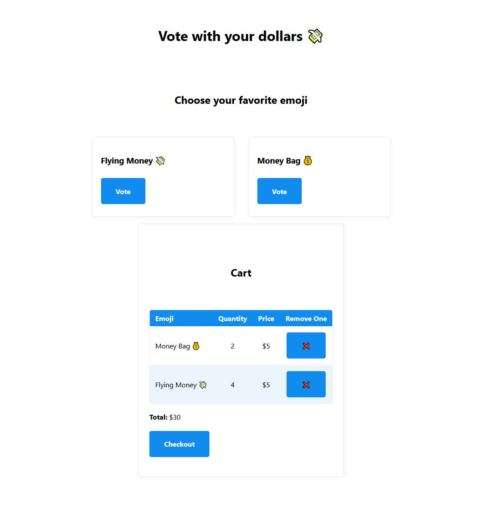

I have my beer can working as a buy button, but what if you want to add products to a cart first.

<!--more-->

## But Why
If you're trying to sell things easily (and cheaply) you can connect Stripe directly to a product page. You can see an example of this from the [stripe beer money]() article.

The main downside is that a customer would have to buy one thing at a time. We can add a cart, but still don't want to require a server.

## Creating a Cart
For a cart, we just need to keep track of items added and how many of each. We can store this information in [localstorage](https://developer.mozilla.org/en-US/docs/Web/API/Window/localStorage). This means if a user comes back to the page, their cart will still be there.

I tested this out with a sample store page. You can see the code at [kasuboski/client-side-cart-example](https://github.com/kasuboski/client-side-cart-example).

[](example-store.png)

It's basically a single `index.html` with `javascript`. It looks for products by finding `buttons` with `data` attributes. These attributes specify the product id, description and price.

When a user clicks the button, the item is added to the cart. This just loads the cart from `localstorage` updates the item quantity and saves it back.

```js
function addToCart(data) {
  var cart = getCart()
  var prevQuantity = cart[data.id] ? cart[data.id].quantity : 0;
  cart[data.id] = {
    quantity: prevQuantity + 1,
    data,
  }

  localStorage.setItem('cart', JSON.stringify(cart));
  
  populateCart();
}
```

The `populateCart` function sets up the cart area every time. There isn't anything fancy here... it just deletes all of the cart elements and recreates based on what's in `localstorage`.

## Next Steps 🦶
This works as a generic cart... but you can't buy anything. I'm going to make an example store to show buying items using Stripe.

Each item will need a Stripe Price and then when you Checkout it will call the Stripe redirect. Eventually, I want to make it easier to integrate as well. Maybe making this an actual library.