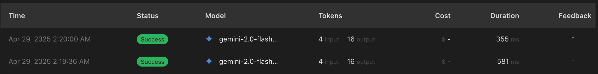

I only speak OpenAI API now. Plus with logging.

<!--more-->

## Why I Needed This

I've been using different AI providers' APIs for various projects, but I faced two main challenges:

1. Each provider has their own SDK and API format, requiring different code paths in my applications
2. I wanted better visibility into what was happening with my requests across all providers

Cloudflare's AI Gateway provides great logging out of the box, but I still had the problem of juggling multiple SDKs and API formats. I wanted a single, consistent interface that would work with any AI provider while giving me all the logging benefits.

That's why I created [openai-gateway](https://github.com/kasuboski/openai-gateway) - a service that exposes an OpenAI-compatible API but can route to different AI providers behind the scenes.

## How It Works

The concept is straightforward:

1. Your application sends requests to my gateway using the OpenAI API format
2. The gateway authenticates your request with a simple API key
3. It translates the request if needed and forwards it through Cloudflare AI Gateway to the appropriate provider (currently supporting Gemini)
4. The response comes back, gets converted to OpenAI format if necessary, and returns to your application
5. Cloudflare logs everything along the way

The whole thing runs as a Cloudflare Worker using Hono, making it lightweight and globally distributed.

## Getting Started

Using it is as simple as changing your base URL. If you're using the OpenAI SDK, it's just:

```javascript
const openai = new OpenAI({
  apiKey: "your-api-key",
  baseURL: "https://your-gateway-url/v1"
});
```

Or with curl:

```bash
curl https://your-gateway-url/v1/chat/completions \
  -H "Content-Type: application/json" \
  -H "Authorization: Bearer your-api-key" \
  -d '{
    "model": "gemini/gemini-pro",
    "messages": [{ "role": "user", "content": "Hello!" }]
  }'
```

Notice that even though we're using Gemini as the provider, we're still using the OpenAI SDK and API format. The model name `gemini/gemini-pro` tells the gateway which provider and model to use.

## What You See in Cloudflare

This is where the magic happens. The Cloudflare dashboard gives you:

- Complete request and response logging
- Token counts for each request
- Cost estimates based on your usage (I was using a free tier key in the screenshot)
- Response times and error rates

All without changing how your application works or adding any custom logging code.



## Lessons Learned

Building this was surprisingly simple. The entire project is just a few hundred lines of code, but it solves a real problem I was having.

I've liked making these small "glue" projects. They don't need to be complex to be useful. Many small tools also makes it easier for the AI coders to work on them.

## What's Next

I've already implemented Gemini as the first provider, and I'm planning to expand support to include:

- More AI providers like Anthropic
- Enable more of the Cloudflare AI Gateway features like caching
- Add request fallbacks, try another model if the first fails

Eventually it could become something more like OpenRouter. 

But for now, it does exactly what I need - gives me visibility without complexity.

## Try It Yourself

If you want to set up your own gateway try it out on cloudflare:

```bash
git clone https://github.com/kasuboski/openai-gateway.git
npm install
npm run dev
```

Or just star the repo and follow along as I add more features!
