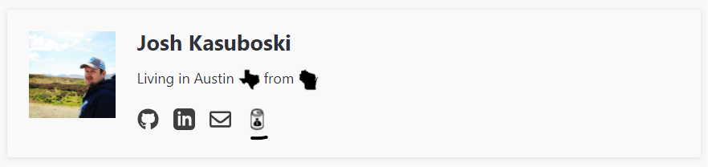
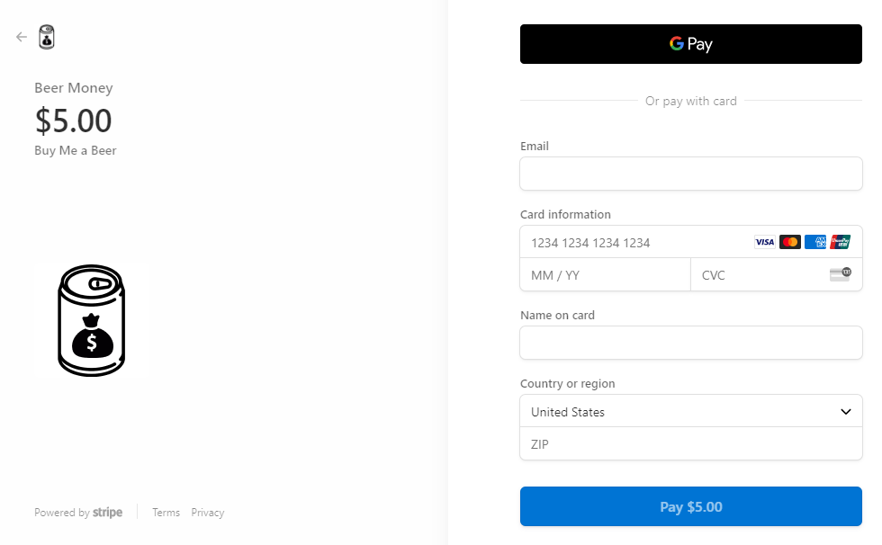

I wanted to explore Stripe Payments, but didn't want to mess with a server. You can see the result as the little beer can in the footer 😉.

<!--more-->

## How It Works
Stripe has a Checkout option where you redirect to their page and it has your product and a payment form. This means you don't have to deal with [PCI](https://www.pcisecuritystandards.org/) anything and basically just have to redirect correctly. They have a library to handle the redirect as well, so it's fairly easy.

You need to place a button that when clicked calls the Stripe Javascript library. Since I'm "selling" beer money, I put a little beer can in my site footer.



## Adding to Your Site
I followed this [guide](https://stripe.com/docs/payments/checkout/client) from Stripe. It was a little difficult to find navigating the Stripe Docs, but searching Stripe Checkout without server brought me there.

I won't reiterate the guide, but basically you use the Stripe Dashboard to make a Product that has a Price. That price will then have an ID that you need. The dashboard will also generate the code snippet with the price ID and your API ID filled in. My edited snippet is below.

You'll notice it also expects a success and cancel URL. I added two pages that just say success, and uh oh respectively.

```html
<script src="https://js.stripe.com/v3"></script>
<script>
  (function () {
    var DOMAIN = 'https://www.joshkasuboski.com/';
    var key = '<pk_livekey>';
    var price = '<price_key>';
    var stripe = Stripe(key);

    var checkoutButton = document.getElementById('checkout-button-beermoney');
    checkoutButton.addEventListener('click', function () {
      // When the customer clicks on the button, redirect
      // them to Checkout.
      stripe.redirectToCheckout({
        lineItems: [{ price: price, quantity: 1 }],
        mode: 'payment',
        // Do not rely on the redirect to the successUrl for fulfilling
        // purchases, customers may not always reach the success_url after
        // a successful payment.
        // Instead use one of the strategies described in
        // https://stripe.com/docs/payments/checkout/fulfillment
        successUrl: DOMAIN + 'success',
        cancelUrl: DOMAIN + 'canceled',
      })
        .then(function (result) {
          if (result.error) {
            // If `redirectToCheckout` fails due to a browser or network
            // error, display the localized error message to your customer.
            var displayError = document.getElementById('error-message');
            displayError.textContent = result.error.message;
          }
        });
    });
  })();
</script>
```

That snippet and the button were all that I needed. Stripe will also provide testing keys for both price and API. So you can test with that first to make sure it is working.

After I set that up, I can click my beer can and end up at a page like below.



💰💰💰 **Profit** 💰💰💰

## Other Cases
This works pretty well if someone would only buy one item at a time. You could probably make a cart entirely on the frontend, keeping track of items a user wants and then when a user clicks `checkout`, you would send multiple `lineItems` in the Stripe Redirect.

This may not be good enough for a real store, but it's pretty convenient to have a fully client-side storefront.
