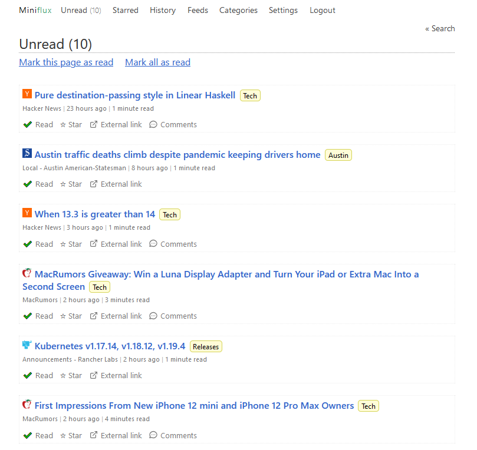

I've wanted to move away from Feedly for awhile and finally found my alternative in Miniflux.

<!--more-->

## Why the move
I had been having issues with the Feedly app where it would suddenly sign me out and take a while to log back in. Apparently that's all it takes for me to drop a service... I also wanted to run something myself and possibly build on top of it.

I had contemplated moving to microsub as outlined in my [replacing Feedly]() post. I tried out [ekster](https://github.com/pstuifzand/ekster) and I think it's still running 🤷‍♂️. I didn't like the readers I tried and wasn't a fan of how ekster doesn't seem to store data persistently.

## Moving to Miniflux
I recently found [miniflux](https://miniflux.app/). It bills itself as "a minimalist and opinionated feed reader". Minimalist and opinionated is all I can hope to be. Thankfully the [opinions](https://miniflux.app/opinionated.html) aligned pretty well with mine.

It's just a go binary and PostgreSQL. I run the binary on my [kubernetes cluster]() and PostgreSQL on a Lenovo Thinkcentre I recently bought. I'm still not super happy in my openEBS storage so am running the database using [podman](https://podman.io/) with a volume mount directly from the node.

Running containers as a non-root account is pretty easy with podman and can be managed by systemd. I did the below to set it up.

```bash
podman create --name postgres -v /home/postgres/postgres:/bitnami/postgresql -e POSTGRESQL_PASSWORD=<root password> -p 5432:5432 bitnami/postgresql:13
podman generate systemd postgres -n
```

You'll notice I'm using the bitnami postgresql image. This image doesn't run as root 👍. The output of the `podman generate systemd` can then be copied to `$HOME/.config/systemd/user`. More info can be found on the podman [site](http://docs.podman.io/en/latest/markdown/podman-generate-systemd.1.html#installation-of-generated-systemd-unit-files).

I like the minimal UI and it works pretty well on mobile as well. The delay in fetching feeds took a little getting used to. I did lower the thresholds, which was just an environment variable config. You can see my kubernetes config in [kasuboski/k8s-gitops](https://github.com/kasuboski/k8s-gitops/blob/master/default/miniflux/deploy.yaml)



## Moving Forward 🐱‍🏍
With Feedly I had a limited set of feed categories because that was a limitation of the free plan. I want to decide what I actually want now that I have no limits with miniflux.

There is also an API that I want to build some things around. My first thought would be to make a way for others to follow what I follow as well.