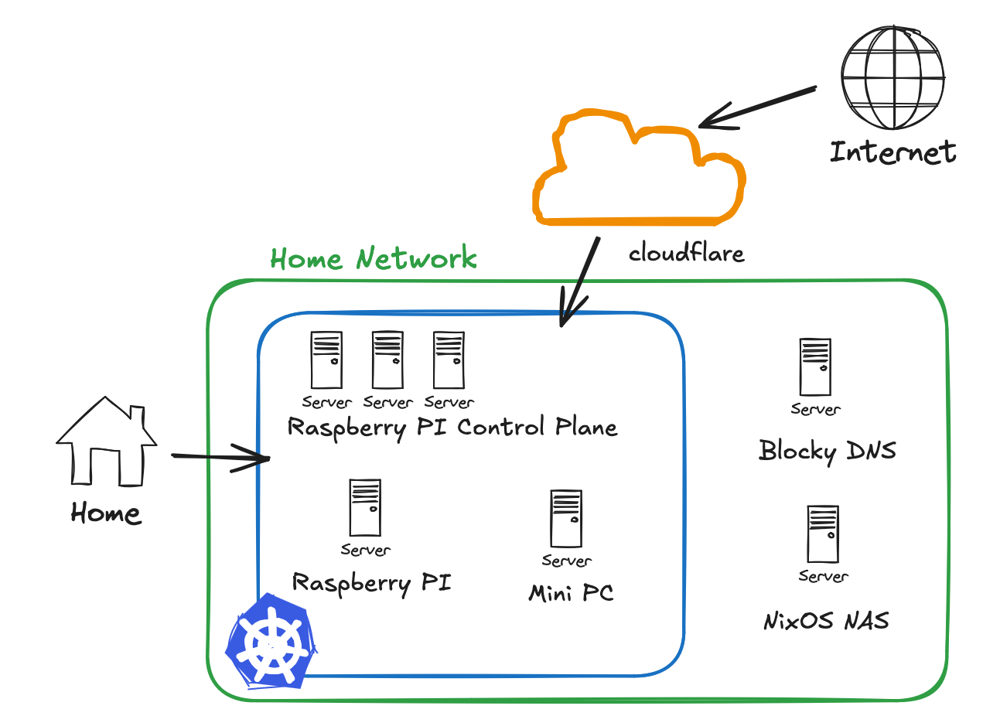

Switching to a Kubernetes OS... Make the machine manage itself 🤖.

<!--more-->

## You what
I've now migrated just about everything from my old [k3s cluster]() to a cluster run by [Talos](https://www.talos.dev/). From the Talos website, "Talos Linux is Linux designed for Kubernetes – secure, immutable, and minimal." It has only what is needed for kubernetes and nothing else. Talos also claims to manage kubernetes operations for you (or at least expose commands for you to do it).

There is no ssh only a gRPC API. You get to install a new `*ctl` to your compute as `talosctl`. It applies declarative config files that manage the system. Most of my setup is checked in to my existing repo [kasuboski/k8s-gitops](https://github.com/kasuboski/k8s-gitops). Depending when you're reading this it might still be on its own branch `feature/talos`.

## The migration
Just changing the kubernetes distribution surely wasn't enough to keep me interested. I also needed to drastically change the nodes, ingress, and templating /s. 

My previous k3s cluster had problems running a cloudflare tunnel consistently. I had ended up moving it out of the cluster until I figured out what was going on. While I was looking for a project to do it automatically I found the [cloudflare-kubernetes-gateway](https://github.com/pl4nty/cloudflare-kubernetes-gateway) project. It implements the Gateway API instead of Ingress and will setup and manage cloudflare tunnel for you. I was surprised how much this just worked after giving it a Cloudflare API key.

I also moved my local ingress from an nginx ingress controller to the [envoy gateway](https://gateway.envoyproxy.io/). It implements the Gateway API by spinning up Envoy pods. I had MetalLB deployed in my old cluster, but never really used it for anything. Now my Envoy Gateway gets an IP address on my home network.

This let me run split dns where if you're on my network my domain routes to the envoy gateway, but from outside you are routed to the cloudflare tunnel. I had generally been too chicken to mess with that before as DNS is always the problem. Indeed I'm still not sure I have the correct setup on my Macbook where Tailscale MagicDNS likes to overwrite my settings.

My home network DNS points to [k8s_gateway](https://github.com/ori-edge/k8s_gateway) running in the cluster that sets the records for the domain to be the MetalLB IP of the Envoy Gateway.

## Hardware Changes
I had stopped running my Raspberry PIs awhile ago as I didn't really have a use for them. Everything I needed to run was fine on just the mini PC or my NAS. Talos promises to make an HA control plane easier to manage though so I figured now's the time.

I now have 3 Raspberry Pi 4 4GB running the kubernetes control plane with etcd running on a USB thumb drive. There is another Raspbery Pi 4 8Gb that is a worker. The HP mini pc is another worker and it has a bigger drive in it to store the sqlite databases for the various media apps.

The Raspberry Pi worker is nice for various apps that don't need storage. For example, ArgoCD and the cluster gateway controllers can run there. I would like to set up replicated storage so more things can move around, but that's more for fun than actual need.

My free Oracle VM is still outside the cluster as I didn't want to deal with indirect connectivity while also learning about Talos. I may try and add it back in now. Talos has a [KubeSpan](https://www.talos.dev/v1.8/talos-guides/network/kubespan) feature that seems like it should make it fine. I am running the Tailscale extension on all of the nodes so far anyway so they should have connectivity.

## Templating Changes
I switched the repo to use [Cuelang](https://cuelang.org/).

Previously, I was already handcrafting most of the yaml and then using kustomize to tie it together. There were a few upstreams that had kustomizations I could pull in and then some helm charts I would manually run `helm template` on.

Now I made a wrapper that reads in a `vendor.cue` file and will download a yaml file from a URL or will run kustomize with a path. It then imports the yaml into Cue and I can use it in my configuration from there. The rest of my repo is structured to match how ArgoCD apps work. Resources are assigned to an app that is then tied to a namespace.

If you look in the repo you'll see a `manifests/` folder than is the output of the Cue files as JSON. ArgoCD is then setup to watch this folder. I'd like to eventually get rid of this setup and use store the manifests in an OCI registry. In the short time this has been setup, I still constantly forget to regenerate that manifests folder. I don't know if I'll modify ArgoCD to work with that setup or do something else. I could perhaps *gasp* generate helm charts that are stored in OCI.

I've liked working with Cue so far. I wish the autocomplete setup in VSCode was better, but I also usually only need to look up a field once since everything else can inherit from a base.

## Moving Forward
I like the setup so far. I'm still worried about etcd burning through those usb drives so I should probably be setting up backups... My other planned changes I've already alluded to. I want to get the free Oracle VM added to the cluster. I also want to get rid of the `manifests` folder that I need to remember to update.

Maybe further down the line I'll try out [kubevirt](https://kubevirt.io/) to mess with development VMs. I've also been looking at running [Piraeus](https://piraeus.io/) since it seems like I could have replicated storage with only 2 nodes and have it be region and zone aware.

