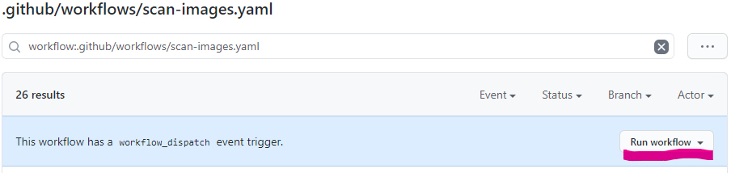
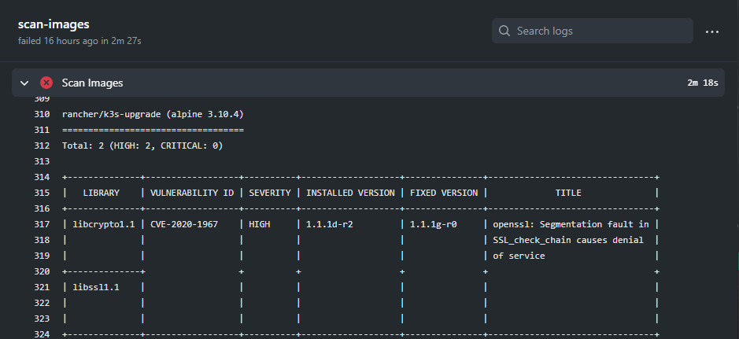

Scanning the container images deployed to my cluster used to be manual. Now it happens automatically every night. 🐱‍🏍

<!--more-->

## How to Scan
I use Trivy to scan container images. I wrote about scanning my GitOps repo for images earlier [here](). Basically, there's a fancy grep that matches `image: (<name>)` and that name is sent to Trivy.

My GitOps repo is on GitHub at [kasuboski/k8s-gitops](https://github.com/kasuboski/k8s-gitops). It seemed natural to run the scan periodically using GitHub Actions. The scan will happen on every push and every night.

I needed a way to exclude an image that wasn't able to scan on an x86 host. The one liner from my previous post needed a `grep -v` to exclude certain patterns.

## Making the GitHub Actions Workflow
I had a lot of trouble getting `ack` configured in a runner. I ended up making a docker image that downloads trivy, finds the images, and scans them.

This image has its own repo [kasuboski/trivy-scan-dir](https://github.com/kasuboski/trivy-scan-dir). If you just want to scan a repo you can run `docker run -it --rm -v /path/to/yaml:/gitops -e EXCLUDED='no/scan also/noscan' kasuboski/trivy-scan-dir`.

To run this in a workflow, add the below step.

```
- name: Scan Images
  uses: docker://kasuboski/trivy-scan-dir:latest
  env:
    EXCLUDED: 'no/scan also/noscan'
```

My full workflow can be found in [kasuboski/k8s-gitops](https://github.com/kasuboski/k8s-gitops/blob/master/.github/workflows/scan-images.yaml). It triggers on `workflow_dispatch`, `cron`, and `push` to yaml files.

Workflow Dispatch lets you run the workflow manually from the GitHub Actions UI. This was really convenient for testing. The cron schedule runs every morning at 4:03am.

[](manual-workflow-run.png)

## Results
This workflow has alerted me to multiple vulnerabilities. If the workflow fails, I get an email and then can look into updating the image.

The results even look pretty decent in the GitHub app so I can tell which images I need to be worried about. An example failing run is shown below.

[](failed-image-scan.png)

I still want to add something in cluster to enforce only the images I want are running. Finding the images to scan also needs to be more robust. For instance, some images only show up once manifests are rendered.